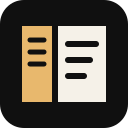
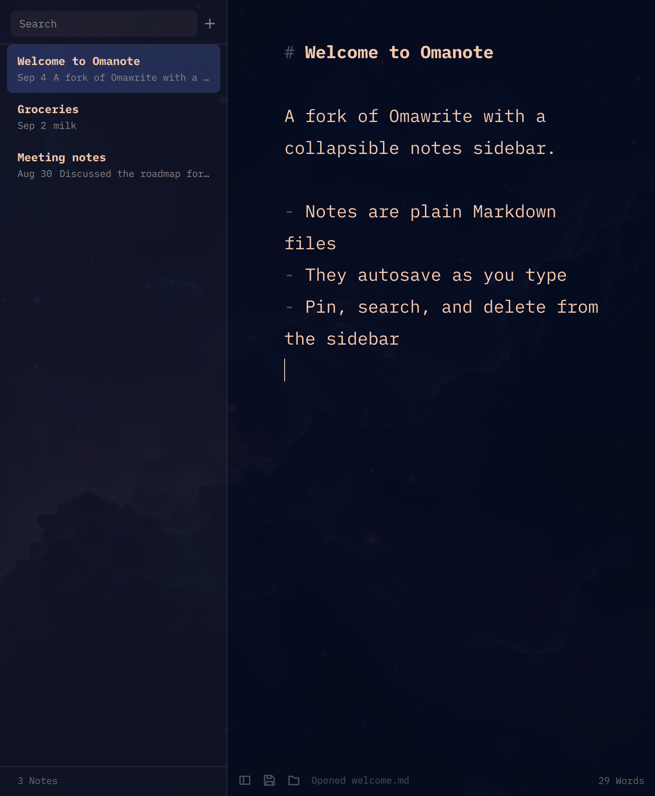

<p align="center"></p>

# Omanote

**Apple Notes for Omarchy, built on Omawrite. Plain Markdown files, a collapsible sidebar, autosave.**

<p align="center"></p>

## The story

I moved from a Mac to Omarchy and did not miss much. The one thing I kept reaching for was Notes. Not
the syncing, not the formatting, just the shape of it: a list of notes down the left, the one I am
working on down the right, a new note one keystroke away, everything saved without me thinking about it.

Omawrite, which ships with Omarchy, turned out to be a wonderful place to type. The iA Writer Mono font,
the theme that follows the system, the complete absence of chrome. But it is one window and one file.
Every note meant a file picker, a name, and a Ctrl+S, and after a week my notes were scattered across
`~` with names like `untitled-3.md`.

So I forked it. Omanote keeps the Omawrite editor exactly as it is and adds the part I missed: a local
folder of notes, a sidebar to move between them, and autosave. When the sidebar is collapsed it is
Omawrite again, pixel for pixel.

## What it does

- **Local storage, plain files.** Every note is a `.md` file in `~/Documents/notes`. Open them in
  anything, grep them, sync them with whatever you already use. File names stay stable.
- **Multi-note editing.** The sidebar lists every note with its title, a one-line preview, and the date.
  Click, or use the keyboard, to switch. The note you leave is saved before the next one loads.
- **Autosave.** A second after you stop typing, on note switch, on window blur, and on quit.
- **Search.** Filters by title and body as you type.
- **Pin.** Pinned notes stay at the top.
- **Delete to the system trash,** with a confirmation, never a silent remove.
- **Collapsible.** `Ctrl+\`, the footer button, or drag the edge closed. The state is remembered.
- **Follows your theme.** Colours come from the same Omarchy theme source Omawrite uses, so changing
  theme restyles the sidebar and editor together, live. Text size follows `omarchy display text size`.
- **Everything Omawrite already did.** Find and replace, print, fullscreen, crash recovery, external
  change detection, and opening any Markdown file with Ctrl+O.

## Install

On Omarchy or any Arch-based system:

```sh
git clone https://github.com/ratandeepbansal/omanote.git
cd omanote
./bin/install
```

Or grab the package from the [latest release](https://github.com/ratandeepbansal/omanote/releases) and
run `sudo pacman -U omanote-*.pkg.tar.zst`.

Omanote installs beside Omawrite with its own binary, config, and data folder. Both keep working.

Requirements: `qt6-base`, `qt6-declarative`, `xdg-desktop-portal`, plus `gcc` and `make` to build.

## Usage

Launch `omanote` from the app menu or a terminal. It opens on your most recent note, or a fresh one if
the folder is empty. Pass a file path to open it directly. Pass `--notes-dir DIR` to use another folder,
or set `notes/folder` in `~/.config/Omacom/omanote.conf`.

### Shortcuts

| Keys | Action |
|---|---|
| `Ctrl+N` | New note |
| `Ctrl+\` | Show or hide the sidebar |
| `Ctrl+Shift+F` | Search notes |
| `Ctrl+Alt+Up` / `Ctrl+Alt+Down` | Previous / next note |
| `Ctrl+Shift+P` | Pin or unpin the current note |
| `Delete` on a selected row | Delete note, with confirmation |
| Right-click a note | Pin, rename file, show in folder, delete |
| `Ctrl+Shift+N` | New window |
| `Ctrl+O` | Open any Markdown file |
| `Ctrl+S` / `Ctrl+Shift+S` | Save / save as, for files outside the notes folder |
| `Ctrl+F` / `Ctrl+H` | Find / find and replace |
| `Ctrl+B` / `Ctrl+I` / `Ctrl+K` | Bold / italic / link |
| `Ctrl+P` | Print |
| `F11` / `Super+F` | Fullscreen |
| `Ctrl+?` | Shortcut reference |

## Requests welcome

This is actively being built, and I am using it every day. If there is something you want from a notes
app on Omarchy, [open an issue](https://github.com/ratandeepbansal/omanote/issues). Folders, tags, a
different sort order, a different default location, a feature from Apple Notes you miss too. Small
requests get built quickly. Pull requests are welcome as well.

## Development

```sh
./bin/build   # qmake + make into build/
./bin/test    # unit and QML integration tests, offscreen
```

The notes library is `src/notesmodel.{h,cpp}` and `src/NotesSidebar.qml`. The editor, theming,
recovery, and the rest is Omawrite's code, extended in `src/backend.cpp` for autosave. `PRD.md`
records the product decisions and what is still open.

## Credits and license

Omanote is MIT licensed, like Omawrite. Omawrite is by David Heinemeier Hansson and contributors at
[omacom-io/omawrite](https://github.com/omacom-io/omawrite), and its copyright notice is retained in
`LICENSE`. The bundled iA Writer Mono font is under the SIL Open Font License 1.1, see `fonts/OFL.txt`.
